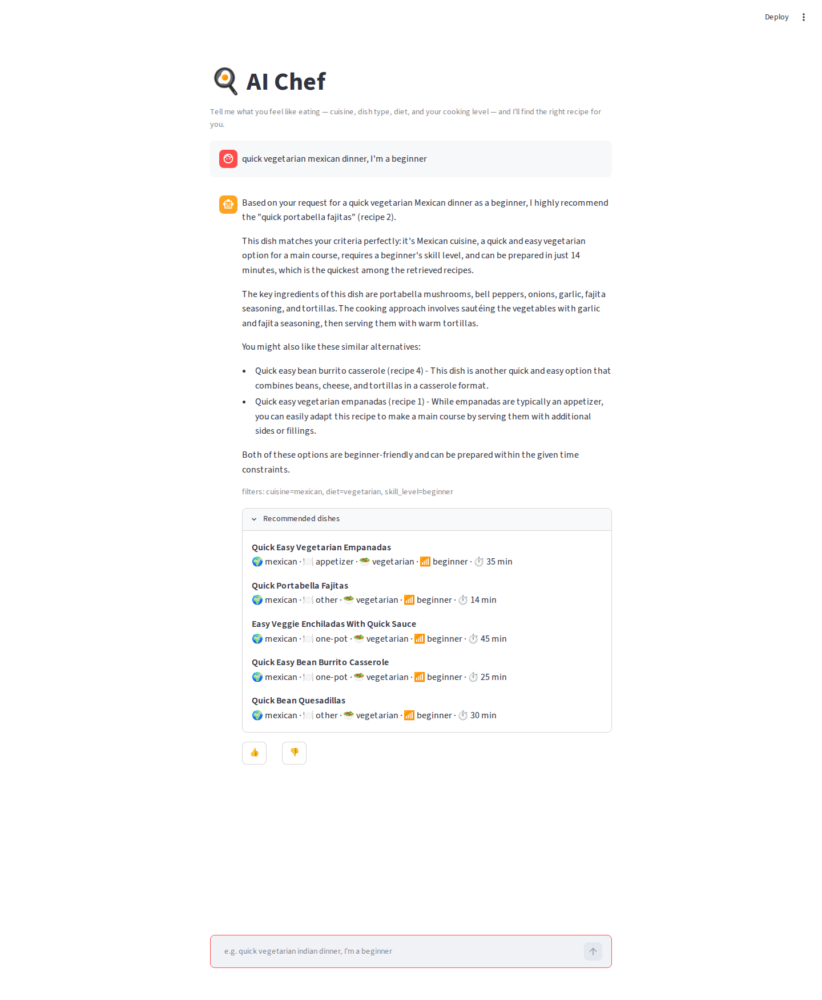
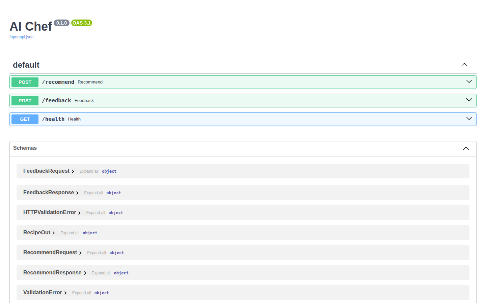
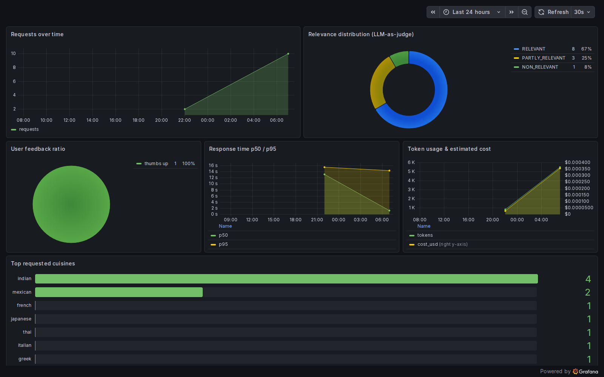

# 🍳 AI Chef

An AI cooking assistant that recommends dishes based on what you're craving —
**cuisine**, **dish type**, **diet/protein**, and your **cooking skill level** —
then walks you through the recipe, suggests similar dishes, and learns from
your 👍/👎 feedback.

Under the hood it's a RAG application: a 10k-recipe knowledge base in
PostgreSQL + pgvector, hybrid retrieval (vector ⊕ full-text) with a
cross-encoder re-ranker, and a Groq LLM that turns retrieved recipes into a
friendly recommendation.



## Why

Recipe sites overwhelm you with thousands of options and don't account for
what cuisine you're craving, what kind of dish you want (one-pot? 30-minute?
dessert?), what you eat, and how skilled you actually are. AI Chef asks for
exactly that in one sentence — *"quick vegetarian mexican dinner, I'm a
beginner"* — and returns a small, well-matched set of recipes instead of an
endless list.

## Architecture

```
┌────────────────────────────────────────────────────────────────┐
│ Streamlit UI (chat)                                            │
│  free-text request  →  recipe cards + similar  →  👍/👎        │
└──────────────┬─────────────────────────────────┬───────────────┘
               │ POST /recommend                  │ POST /feedback
               ▼                                  ▼
┌────────────────────────────────────────────────────────────────┐
│ FastAPI                                                        │
│  1. query rewrite + filter extraction (Groq, structured out)   │
│  2. hybrid search: pgvector ⊕ full-text + filters,             │
│     cross-encoder re-ranks top-20 → top-5                      │
│     (embedder + re-ranker run on ONNX Runtime — no torch)      │
│  3. build prompt → Groq LLM answer                             │
│  4. inline LLM-as-judge relevance + token/cost tracking        │
│  5. log conversation → Postgres                                │
└──────────────┬─────────────────────────────────────────────────┘
               ▼
┌────────────────────────────────────────────────────────────────┐
│ PostgreSQL + pgvector                                          │
│  ├── recipes        (knowledge base: text + embedding + meta)  │
│  ├── conversations  (question, answer, relevance, tokens, ms)  │
│  └── feedback       (conversation_id, +1/-1)                   │
└──────────────┬─────────────────────────────────────────────────┘
               ▼
┌────────────────────────────────────────────────────────────────┐
│ Grafana (auto-provisioned dashboard, 6 charts)                 │
└────────────────────────────────────────────────────────────────┘
```

## Tech stack

| Layer | Choice |
|---|---|
| LLM | Groq — `llama-3.1-8b-instant` (answers), `llama-3.3-70b-versatile` (judge) |
| Embeddings | `all-MiniLM-L6-v2` (384-dim) — ONNX Runtime in the API image |
| Re-ranker | `cross-encoder/ms-marco-MiniLM-L-6-v2` — ONNX Runtime |
| Knowledge base | PostgreSQL 16 + pgvector (vector + FTS + app data in one) |
| API | FastAPI (`/recommend`, `/feedback`, `/health`) |
| UI | Streamlit chat with recipe cards + thumbs feedback |
| Monitoring | Grafana, auto-provisioned from `grafana/` |
| Containers | Docker Compose: api + streamlit + postgres + grafana |

Everything runs from a single `docker compose up`.

## Quick start

**Prerequisites:** Docker + Docker Compose, a free
[Groq API key](https://console.groq.com/keys), and [uv](https://docs.astral.sh/uv/)
(only needed for the one-time data ingestion, which runs on the host).

```bash
git clone <this-repo> && cd ai-chef
cp .env.example .env          # add your GROQ_API_KEY

docker volume create ai_chef_postgres_data   # named volume for the recipe DB
docker compose up -d --build                 # postgres + api + streamlit + grafana

# one-time: embed 10k recipes into pgvector (runs on the host, ~2-5 min on CPU)
uv sync
uv run python -m pipeline.ingest
```

Then open:

| Service | URL |
|---|---|
| **Streamlit chat UI** | http://localhost:8501 |
| FastAPI docs (Swagger) | http://localhost:8000/docs |
| Grafana dashboard | http://localhost:3000 (anonymous, no login) |

> The 10k-recipe sample (`data/recipes_10k.csv`) is committed to the repo, so
> ingestion works offline — no Kaggle/Hugging Face dataset download needed.
> To rebuild the sample from scratch (231k Food.com recipes):
> `uv run python -m pipeline.prepare_data` after placing `RAW_recipes.csv`
> in `data/` (see [PLAN.md](PLAN.md#4-dataset) for the source).

## Usage

**Chat UI** — describe what you want in one message:

> *"I want a spicy indian chicken curry, something beginner-friendly"*

AI Chef extracts filters (`cuisine=indian, dish_type=curry, diet=non-veg,
skill_level=beginner, protein=chicken`), retrieves matching recipes, and
answers with a recommendation, why it fits, similar dishes, and recipe cards.
Rate the answer with 👍/👎 — feedback lands in Grafana.

**API** — same flow over REST:

```bash
curl -X POST localhost:8000/recommend \
  -H 'Content-Type: application/json' \
  -d '{"question": "quick vegetarian mexican dinner, I'\''m a beginner", "k": 5}'
```

```bash
curl -X POST localhost:8000/feedback \
  -H 'Content-Type: application/json' \
  -d '{"conversation_id": "<id from /recommend>", "feedback": 1}'
```

| Endpoint | Method | Body | Returns |
|---|---|---|---|
| `/recommend` | POST | `{question, k=1..10}` | answer, recipe cards, extracted filters, judge relevance, tokens, ms |
| `/feedback` | POST | `{conversation_id, feedback: +1/-1}` | `{status: ok}` |
| `/health` | GET | — | `{status, recipes}` |



## Monitoring

Every `/recommend` call is logged to Postgres (question, answer, extracted
filters, model, response time, prompt/completion/total tokens, inline
LLM-as-judge relevance) and every 👍/👎 to the feedback table. Grafana is
auto-provisioned with a 6-panel dashboard:

requests over time · relevance distribution · feedback ratio ·
response time p50/p95 · token usage & estimated cost · top requested cuisines



## Evaluation

All key design choices were measured, not guessed. Evaluation scripts live in
`pipeline/` and results in `data/`.

**Retrieval** — 788 user-style questions generated with Groq as ground truth,
Hit Rate / MRR @ k=5 (`uv run python -m pipeline.evaluate_retrieval`):

| Approach | HR@5 | MRR | Latency |
|---|---|---|---|
| **hybrid + re-rank** ✅ | **0.208** | **0.134** | 83 ms |
| hybrid (RRF) | 0.184 | 0.108 | 51 ms |
| full-text only | 0.156 | 0.092 | 29 ms |
| vector only | 0.126 | 0.071 | 34 ms |

**Answer generation** — 2 models × 2 prompt variants, judged by
`llama-3.3-70b-versatile` (LLM-as-a-judge), n≈44 per cell
(`uv run python -m pipeline.evaluate_rag`):

| Model | Prompt | RELEVANT | PARTLY | NON_REL | Avg tokens | Latency |
|---|---|---|---|---|---|---|
| **llama-3.1-8b-instant** ✅ | **detailed** | **0.82** | 0.14 | 0.05 | 626 | 634 ms |
| llama-3.3-70b-versatile | detailed | 0.72 | 0.28 | 0.00 | 577 | 986 ms |
| llama-3.3-70b-versatile | concise | 0.57 | 0.41 | 0.02 | 415 | 517 ms |
| llama-3.1-8b-instant | concise | 0.52 | 0.45 | 0.02 | 464 | 409 ms |

Winner: **hybrid+rerank retrieval** and **llama-3.1-8b + detailed prompt** —
the smaller model with the better prompt beat the 70b, and it's faster and
cheaper. Prompt variant mattered more than model size.

## Repository layout

```
ai-chef/
├── PLAN.md                     # project plan + decisions log
├── docker-compose.yaml         # api + streamlit + postgres + grafana
├── Dockerfile                  # API image (torch-free, ONNX Runtime)
├── Dockerfile.streamlit        # UI image (streamlit only, no ML deps)
├── api/
│   ├── main.py                 # /recommend, /feedback, /health
│   ├── rag.py                  # rewrite → search → prompt → Groq → judge
│   ├── search.py               # text / vector / hybrid / hybrid+rerank
│   ├── onnx_models.py          # ONNX embedder + re-ranker (docker images)
│   ├── db.py                   # conversation + feedback logging
│   └── schemas.py              # Pydantic models
├── streamlit_app/app.py        # chat UI + recipe cards + 👍/👎
├── pipeline/
│   ├── prepare_data.py         # Food.com 231k → 10k sample + derived fields
│   ├── ingest.py               # embed → pgvector
│   ├── generate_ground_truth.py
│   ├── evaluate_retrieval.py   # HR / MRR across approaches
│   └── evaluate_rag.py         # model × prompt, LLM-as-judge
├── grafana/                    # auto-provisioned datasource + dashboard
├── scripts/init_db.sql         # pgvector extension + tables + indexes
├── tests/test_search.py        # smoke tests (search + filters)
└── data/recipes_10k.csv        # the knowledge base (committed)
```

## Development

```bash
uv sync                                    # host env (base + dev groups)
uv run uvicorn api.main:app --reload       # run API on the host
uv run --group ui streamlit run streamlit_app/app.py   # run UI on the host
uv run python -m tests.test_search         # smoke tests (needs postgres + data)
uv run python -m pipeline.evaluate_retrieval   # re-run retrieval eval
uv run python -m pipeline.evaluate_rag         # re-run RAG eval (uses Groq quota)
```

Dependency groups (see `pyproject.toml`): **base** = API runtime (torch-free,
ONNX Runtime + tokenizers), **ui** = Streamlit app, **dev** = host tooling
(ingestion/eval, pulls in torch via sentence-transformers). The Docker images
install only what they need: api ≈ 760 MB, streamlit ≈ 670 MB.

`MODEL_BACKEND` selects the inference backend in `api/search.py`: `onnx`
(set in the API image, models baked into `/app/models`) or `st`
(sentence-transformers, default on the host). The fp32 ONNX graphs are
numerically equivalent (embedder cosine ≈ 1.0, re-ranker |Δ| ≈ 5e-6), so both
backends query the same pgvector knowledge base interchangeably.

## Environment variables

See [.env.example](.env.example). Essentials: `GROQ_API_KEY` (required),
`POSTGRES_*` (defaults match compose), `GROQ_MODEL` / `GROQ_JUDGE_MODEL` /
`EMBEDDING_MODEL` to swap models.

## Roadmap

Done: data → ingestion → retrieval eval → RAG eval → API → UI → monitoring →
docker → docs. Optional next: Prefect ingestion flow, cloud deploy
(Vercel + Streamlit Cloud + Neon). See [PLAN.md](PLAN.md).
